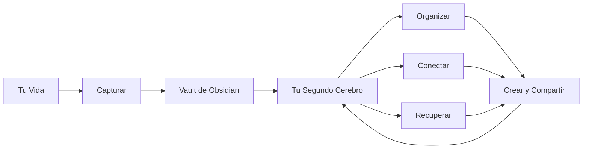

# ¿Qué es un Segundo Cerebro?

Probablemente ya te pasó: leíste un artículo, viste un video, estuviste en una reunión, aprendiste algo copado — y dos semanas después, se te olvidó. Puf.

No es un defecto. Así funciona la memoria humana. No estamos diseñados para guardar todo. Estamos diseñados para *pensar* con lo que tenemos.

Un **Segundo Cerebro** es un sistema externo que guarda lo que tu memoria no puede — para que te puedas concentrar en pensar, crear y tomar decisiones en vez de intentar recordar.

## La Idea Central

> No recuerdes. Recuperá.

En vez de memorizar todo, armás un sistema de confianza donde podés encontrar cualquier cosa que hayas aprendido, pensado o creado — en segundos.

Pensalo como un motor de búsqueda para tu propia mente.

## ¿Por Qué Necesitás Uno?

| Sin un Segundo Cerebro | Con un Segundo Cerebro |
|------------------------|------------------------|
| "Leí algo sobre eso alguna vez..." | "Acá está exactamente lo que guardé sobre eso" |
| Caos de bookmarks en 3 navegadores | Todo en un solo lugar, searchable |
| Notas desparramadas en 5 apps | Un sistema, un hogar |
| Ideas geniales olvidadas | Ideas capturadas y conectadas |
| Reescribir la misma investigación | Construyendo sobre lo que ya sabés |

## ¿De Dónde Viene Esto?

El concepto fue formalizado por **Tiago Forte** en su libro *Building a Second Brain* (2022). Su metodología, conocida como **BASB**, introduce un framework llamado **CODE**:

1. **C**apturar — Guardar lo que te resuena
2. **O**rganizar — Ponerlo donde lo vas a encontrar
3. **D**estilar — Extraer la esencia
4. **E**xpresar — Usarlo para crear algo

No necesitás seguir BASB religiosamente para beneficiarte de un Segundo Cerebro. Los principios son universales.

## ¿Qué Hace a un Buen Segundo Cerebro?

- **Captura sin fricción** — Podés guardar algo en 2 segundos o menos
- **Searchable** — Encontrás cualquier cosa con una palabra clave, tag o link
- **Conectado** — Las ideas se linked a otras ideas (no notas aisladas)
- **Personal** — Funciona para *tu* cerebro, no para el de otra persona
- **Duradero** — Crece con vos a lo largo de años, no semanas

## Lo Que NO Es

- ❌ Una lista de tareas (aunque puede incluir tareas)
- ❌ Un diario (aunque puede incluir reflexiones)
- ❌ Una carpeta de archivos random que nunca vas a abrir
- ❌ Algo que requiere horas de mantenimiento diario
- ❌ Solo para gente "inteligente" u "organizada"

## La Herramienta: ¿Por Qué Obsidian?

Hay muchas apps para armar un Segundo Cerebro (Notion, Roam Research, Logseq, Apple Notes...). Recomendamos **Obsidian** porque:

- 📁 **Archivos locales** — Tus notas viven en tu compu como archivos Markdown. Sin vendor lock-in.
- 🔗 **Pensamiento conectado** — Conectá notas con `[[wikilinks]]`, ve backlinks, armá un knowledge graph
- 🧩 **Extensible** — Más de 1,000 plugins comunitarios para lo que se te ocurra
- 💰 **Gratis** — La app core es gratis para siempre en todas las plataformas
- 🔒 **Privado** — Tus datos nunca salen de tu máquina (a menos que vos quieras)
- 📱 **Multiplataforma** — macOS, Windows, Linux, iOS, Android

## El Panorama General

## ¿Qué Sigue?

Ahora que sabés *qué* es un Segundo Cerebro, vamos a configurar todo.

→ **[02 — Aplicaciones que vas a necesitar](./02-apps-you-need.es.md)**

---

[← Volver a guías](../../) · [English](../en/01-what-is-second-brain.md)
