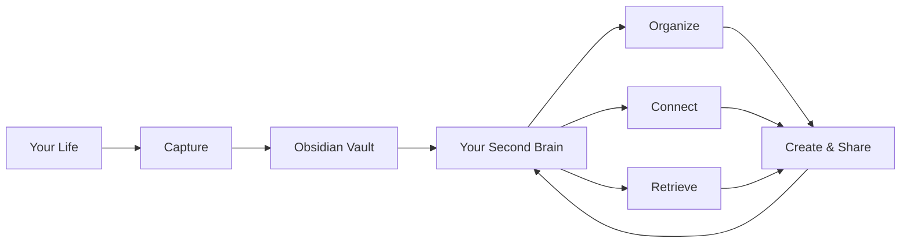

# What is a Second Brain?

You've probably been there: you read an article, watch a video, attend a meeting, learn something cool — and two weeks later, it's gone. Poof.

That's not a flaw. That's how human memory works. We're not built to store everything. We're built to *think* with what we have.

A **Second Brain** is an external system that stores the things your memory can't — so you can focus on thinking, creating, and making decisions instead of trying to remember.

## The Core Idea

> Don't remember. Retrieve.

Instead of memorizing everything, you build a trusted system where you can find anything you've ever learned, thought, or created — in seconds.

Think of it as a search engine for your own mind.

## Why Do You Need One?

| Without a Second Brain | With a Second Brain |
|------------------------|---------------------|
| "I read something about that once..." | "Here's exactly what I saved about that" |
| Bookmark chaos across 3 browsers | Everything in one searchable place |
| Notes scattered in 5 apps | One system, one home |
| Great ideas forgotten | Ideas captured and connected |
| Rewriting the same research | Building on what you already know |

## Where Did This Come From?

The concept was formalized by **Tiago Forte** in his book *Building a Second Brain* (2022). His methodology, often called **BASB**, introduced a framework called **CODE**:

1. **C**apture — Save what resonates
2. **O**rganize — Put it where you'll find it
3. **D**istill — Extract the essence
4. **E**xpress — Use it to create something

You don't need to follow BASB religiously to benefit from a Second Brain. The principles are universal.

## What Makes a Good Second Brain?

- **Frictionless capture** — You can save something in 2 seconds or less
- **Searchable** — Find anything with a keyword, tag, or link
- **Connected** — Ideas link to other ideas (not isolated notes)
- **Personal** — It works for *your* brain, not someone else's
- **Durable** — It grows with you over years, not weeks

## What It's NOT

- ❌ A to-do list (though it can include tasks)
- ❌ A journal (though it can include reflections)
- ❌ A folder of random files you'll never open again
- ❌ Something that requires hours of daily maintenance
- ❌ Only for "smart" or "organized" people

## The Tool: Why Obsidian?

There are many apps for building a Second Brain (Notion, Roam Research, Logseq, Apple Notes...). We recommend **Obsidian** because:

- 📁 **Local files** — Your notes live on your computer as plain Markdown. No vendor lock-in.
- 🔗 **Linked thinking** — Connect notes with `[[wikilinks]]`, see backlinks, build a knowledge graph
- 🧩 **Extensible** — 1,000+ community plugins for anything you can imagine
- 💰 **Free** — The core app is free forever on all platforms
- 🔒 **Private** — Your data never leaves your machine (unless you want it to)
- 📱 **Cross-platform** — macOS, Windows, Linux, iOS, Android

## The Big Picture

## What's Next?

Now that you know *what* a Second Brain is, let's get you set up.

→ **[02 — Apps You'll Need](./02-apps-you-need.md)**

---

[← Back to guides](../../) · [Español](../es/01-what-is-second-brain.md)
