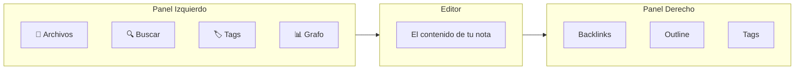

# Configurar Obsidian

Ya descargaste Obsidian. Ahora hagamos que sea tuyo.

## Paso 1: Creá tu Vault

Cuando abrís Obsidian por primera vez, te pide crear un **vault**.

Un vault es simplemente una carpeta en tu compu. Todas tus notas viven adentro como archivos `.md` (Markdown) comunes.

1. Clickeá **"Create new vault"**
2. Ponele el nombre que quieras. Algunas ideas:
   - `second-brain`
   - `mi-cerebro`
   - `base-de-conocimiento`
   - Tu nombre + "notas" (ej: `vanessa-notas`)
3. Elegí dónde guardarlo. **Elegí un lugar que te acuerdes**:
   - 📁 Carpeta Documentos (recomendado)
   - 📁 Una carpeta dedicada en tu home
   - ☁️ Carpeta de iCloud/OneDrive (si querés sync en la nube — más abajo)

> ⚠️ **No uses** espacios ni caracteres especiales en el nombre del vault. Usá guiones: `second-brain`, no `second brain`.

## Paso 2: La Interfaz (Tour Rápido)

Obsidian abre con una interfaz limpia y minimalista. Esto es lo que necesitás saber:



- **Panel izquierdo** — Explorador de archivos, búsqueda, tags, vista de grafo
- **Centro** — Tu editor de notas (Markdown)
- **Panel derecho** — Backlinks, outline, tags (se abre con el ícono arriba a la derecha)

Podés ocultar los paneles con las flechitas en las esquinas de arriba.

## Paso 3: Creá Tu Primera Nota

1. Presioná `Ctrl+N` (Windows/Linux) o `Cmd+N` (macOS)
2. O cliqueá el **ícono ✏️** arriba a la izquierda
3. Poné un nombre para tu nota — ej: `Bienvenida`
4. ¡Escribí algo!

### Markdown Básico (5 cosas que necesitás saber)

```markdown
# Título Grande
## Título Mediano
### Título Chico

**Texto en negrita**
*Texto en itálica*

- Un bullet
- Otro bullet

[[Link a otra nota]]

- [ ] Tarea pendiente
- [x] Tarea completada
```

Eso es el 90% de lo que vas a usar todos los días. No necesitás memorizar más.

## Paso 4: Linkeá Tus Primeras Notas

La magia de Obsidian son los **links**. Probá esto:

1. Creá una nota que se llame `Libros que quiero leer`
2. Creá otra nota que se llame `Hábitos Atómicos`
3. En la primera nota, escribí `[[Hábitos Atómicos]]` — ¡se convierte en un link!
4. Clickealo — te lleva a la otra nota
5. Abrí `Hábitos Atómicos` y mirá el panel de **Backlinks** — vas a ver dónde está referenciada

Esta es la base de tu Segundo Cerebro: **ideas conectadas a otras ideas**.

## Paso 5: Activá los Plugins Core

Obsidian tiene plugins integrados que están desactivados por defecto. Activemos los útiles:

1. Andá a **Settings** (⚙️ ícono de engranaje, abajo a la izquierda)
2. Andá a **Core plugins**
3. Activá estos:

| Plugin | Qué hace |
|--------|----------|
| ✅ **Daily notes** | Crear una nota por día (genial para journaling) |
| ✅ **Templates** | Reusar templates de notas |
| ✅ **Slash commands** | Escribí `/` para insertar cosas rápido |
| ✅ **Outgoing links** | Ver a qué se linked una nota |
| ✅ **Unique note creator** | Generar notas con IDs únicos (avanzado) |

Podés ignorar el resto por ahora sin problema.

## Paso 6: Configurá las Notas Diarias

Las notas diarias son un buen hábito. Configuremos:

1. En **Settings → Core plugins → Daily notes** (clikeá el engranaje al lado)
2. Poné **New file location** en: `daily`
3. Poné **Template file location** en: `templates/daily-template` (lo creamos después)
4. Poné **Date format** en: `YYYY-MM-DD`

Ahora cliqueá el **ícono 📅 calendario** en el panel izquierdo para crear la nota de hoy.

## Sync en la Nube (Opcional)

Los archivos de Obsidian son carpetas comunes. Podés sincronizarlos como quieras:

| Método | ¿Gratis? | Notas |
|--------|----------|-------|
| **Obsidian Sync** | No ($4/mes) | El más fácil, integrado, encriptado end-to-end |
| **iCloud** | Sí (Apple) | Poné el vault en la carpeta de iCloud Drive |
| **OneDrive** | Sí (Windows) | Poné el vault en la carpeta de OneDrive |
| **Google Drive** | Sí | Funciona pero menos confiable para edición en vivo |
| **Git** | Gratis | Para developers — versionar tu vault |

> ⚠️ **No pongas** tu vault en múltiples carpetas de nube al mismo tiempo. Elegí una.

## Ya Estás Listo/a

Tu vault está configurado. Podés crear notas, linkearlas y encontrar cosas. Eso ya es un Segundo Cerebro.

Ahora hagámoslo poderoso.

→ **[04 — Estructura del Vault](./04-vault-structure.es.md)**

---

[← 02 — Aplicaciones que vas a necesitar](./02-apps-you-need.md) · [English](../en/03-setting-up-obsidian.md)
