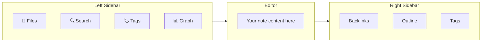

# Setting Up Obsidian

You downloaded Obsidian. Now let's make it yours.

## Step 1: Create Your Vault

When you open Obsidian for the first time, it asks you to create a **vault**.

A vault is simply a folder on your computer. All your notes live inside it as plain `.md` (Markdown) files.

1. Click **"Create new vault"**
2. Name it whatever you want. Some ideas:
   - `second-brain`
   - `my-brain`
   - `knowledge-base`
   - Your name + "notes" (e.g., `vanessa-notes`)
3. Choose where to save it. **Pick a location you'll remember**:
   - 📁 Documents folder (recommended)
   - 📁 A dedicated folder in your home directory
   - ☁️ iCloud/OneDrive folder (if you want cloud sync — more on this below)

> ⚠️ **Don't use** spaces or special characters in the vault name. Use hyphens instead: `second-brain`, not `second brain`.

## Step 2: The Interface (Quick Tour)

Obsidian opens to a clean, minimal interface. Here's what you need to know:



- **Left sidebar** — File explorer, search, tags, graph view
- **Center** — Your note editor (Markdown)
- **Right sidebar** — Backlinks, outline, tags (open with the top-right icon)

You can toggle sidebars with the arrows at the top corners.

## Step 3: Create Your First Note

1. Press `Ctrl+N` (Windows/Linux) or `Cmd+N` (macOS)
2. Or click the **✏️ icon** in the top left
3. Type a name for your note — e.g., `Welcome`
4. Write something!

### Basic Markdown (5 things to know)

```markdown
# Big Heading
## Medium Heading
### Small Heading

**Bold text**
*Italic text*

- Bullet point
- Another point

[[Link to another note]]

- [ ] To-do item
- [x] Done item
```

That's 90% of what you'll use daily. You don't need to memorize more.

## Step 4: Link Your First Notes

The magic of Obsidian is **linking**. Try this:

1. Create a note called `Books I Want to Read`
2. Create another note called `Atomic Habits`
3. In the first note, type `[[Atomic Habits]]` — it becomes a link!
4. Click it — it takes you to the other note
5. Open `Atomic Habits` and check the **Backlinks** panel — you'll see where it's referenced

This is the foundation of your Second Brain: **ideas connected to other ideas**.

## Step 5: Enable Core Plugins

Obsidian has built-in plugins that are disabled by default. Let's turn on the useful ones:

1. Go to **Settings** (⚙️ gear icon, bottom left)
2. Go to **Core plugins**
3. Enable these:

| Plugin | What it does |
|--------|-------------|
| ✅ **Daily notes** | Create one note per day (great for journaling) |
| ✅ **Templates** | Reuse note templates |
| ✅ **Slash commands** | Type `/` to quickly insert things |
| ✅ **Outgoing links** | See what a note links to |
| ✅ **Unique note creator** | Generate notes with unique IDs (advanced) |

You can safely ignore the rest for now.

## Step 6: Configure Daily Notes

Daily notes are a great habit. Let's set them up:

1. In **Settings → Core plugins → Daily notes** (click the gear next to it)
2. Set **New file location** to: `daily`
3. Set **Template file location** to: `templates/daily-template` (we'll create this later)
4. Set **Date format** to: `YYYY-MM-DD`

Now click the **📅 calendar icon** in the left sidebar to create today's note.

## Cloud Sync (Optional)

Obsidian's files are regular folders. You can sync them however you want:

| Method | Free? | Notes |
|--------|-------|-------|
| **Obsidian Sync** | No ($4/mo) | Easiest, built-in, end-to-end encrypted |
| **iCloud** | Yes (Apple) | Put vault in iCloud Drive folder |
| **OneDrive** | Yes (Windows) | Put vault in OneDrive folder |
| **Google Drive** | Yes | Works but less reliable for live editing |
| **Git** | Free | For developers — version control your vault |

> ⚠️ **Don't** put your vault in multiple cloud folders at the same time. Pick one.

## You're Ready

Your vault is set up. You can create notes, link them, and find things. That's a Second Brain.

Now let's make it powerful.

→ **[04 — Vault Structure](./04-vault-structure.md)**

---

[← 02 — Apps You'll Need](./02-apps-you-need.md) · [Español](../es/03-setting-up-obsidian.md)
