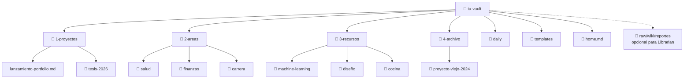
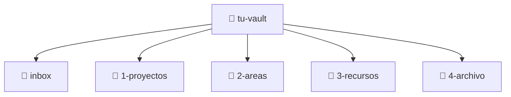

# Estructura del Vault

Un vault sin estructura se convierte en un cajón desastre. Un vault con demasiada estructura se convierte en una prisión.

El objetivo: **suficiente estructura para encontrar las cosas, no tanta que te frene.**

## El Método PARA

El sistema de organización más popular para un Segundo Cerebro es **PARA**, creado por Tiago Forte:

| Carpeta | Qué va acá | Ejemplo |
|---------|-----------|---------|
| **P**royectos | Cosas activas con deadline o meta | `lanzamiento-portfolio`, `tesis-2026` |
| **Á**reas | Responsabilidades ongoing sin fecha de fin | `salud`, `finanzas`, `carrera` |
| **R**ecursos | Temas que te interesan | `machine-learning`, `diseño`, `cocina` |
| **A**rchivo | Proyectos completados e items inactivos | `proyecto-viejo-2024` |

### Cómo se ve en tu vault:



> 💡 Los números (1-, 2-, 3-, 4-) mantienen las carpetas en orden de prioridad en el explorador de archivos.

## Capa opcional para IA: Librarian

Si vas a usar Librarian, agregá tres carpetas extra al nivel raíz del vault. No reemplazan PARA: viven al lado.

```text
vault/
  1-proyectos/
  2-areas/
  3-recursos/
  4-archivo/
  daily/
  inbox/
  templates/
  home.md

  raw/        # fuentes curadas para IA; Librarian las lee como source of truth
  wiki/       # páginas mantenidas por Librarian
  reportes/   # diagnósticos y propuestas revisables
```

Usá `inbox/` para captura humana rápida. Mové a `raw/` solo las fuentes que querés que Librarian procese. Esa separación funciona como una frontera de consentimiento: no todo lo que capturás entra automáticamente a la capa de IA.

Dentro de `wiki/`, Librarian espera esta estructura:

```text
wiki/
  index.md
  log.md
  conceptos/
  entidades/
  sources/
  synthesis/
```

## La Nota Home

Creá una nota llamada `home.md` y pineala como nota de apertura. Este es tu **dashboard** — lo primero que ves cuando abrís Obsidian.

```markdown
# 🏠 Home

## Proyectos Activos
- [[lanzamiento-portfolio]] — Lanzar antes de junio
- [[tesis-2026]] — Primer borrador para abril

## Links Rápidos
- [[lista-de-lectura]]
- [[template-revision-semanal]]
- [[tracker-habitos]]

## Hoy
![[{{date:YYYY-MM-DD}}]]
```

> Para pinear una nota: click derecho en la pestaña → **"Pin"**. Se queda abierta cuando cambiás de nota.

## Convenciones de Nombres

Un buen naming hace todo searchable:

| Regla | Ejemplo |
|-------|---------|
| Usá minúsculas con guiones | `machine-learning.md`, no `Machine Learning.md` |
| Sé descriptivo/a | `preguntas-prep-entrevista.md`, no `notas2.md` |
| Prefijo de fecha para notas temporales | `2026-05-12-reunion-con-ana.md` |
| Usá carpetas para agrupar | `carrera/`, no 50 archivos sueltos |

## Cuando no sepas: Inbox

¿No estás segura dónde va una nota? Creá una carpeta `inbox/`. Tirá cosas ahí y ordenalas después en la revisión semanal.



> El inbox no es un tacho. Limpiálo semanalmente. Si una nota pasa un mes ahí, archivala o borrala.

## El MOC (Mapa de Contenido)

A medida que tu vault crece, vas a querer **MOCs** — notas índice que linkean a notas relacionadas de un tema.

```markdown
# 🗺️ Machine Learning MOC

## Fundamentos
- [[que-es-machine-learning]]
- [[supervisado-vs-no-supervisado]]
- [[algoritmos-comunes]]

## Cursos
- [[notas-curso-andrew-ng]]
- [[lecturas-fast-ai]]

## Práctica
- [[proyectos-kaggle]]
- [[prep-entrevista-ml]]
```

Los MOCs son como índices para tu cerebro. Empezá a crearlos cuando un tema tenga 5+ notas.

## No lo Pienses Demasiado

La estructura perfecta no existe. Empezá con PARA, ajustá sobre la marcha. Tu vault te va a decir qué necesita después de unas semanas de uso.

**Principios antes que reglas.**

## ¿Qué sigue?

→ **[05 — Plugins esenciales](./05-essential-plugins.md)**

---

[← 03 — Configurar Obsidian](./03-setting-up-obsidian.md) · [English](../en/04-vault-structure.md)
